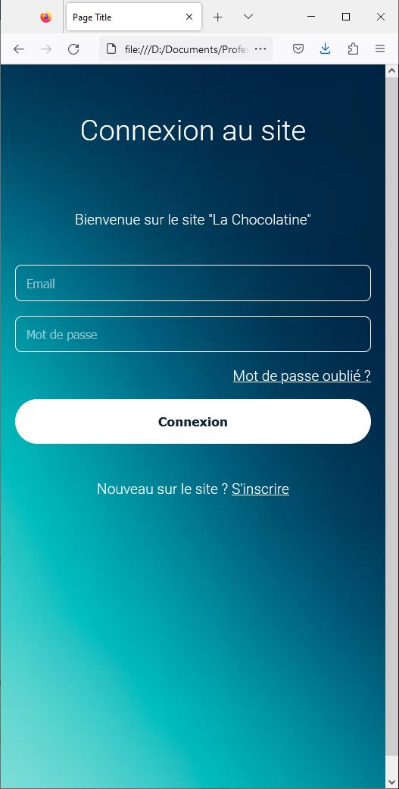

# Construire un écran de connexion (partie 1)

TP du module 4 – Les bases du CSS

> **Note:** Avant de démarrer ce TP, il convient d’avoir suivi les vidéos des modules 1 à 4 et d’avoir réalisé les TP proposés.

**Durée Estimée : 2h**

## Enonce

Créer un nouveau projet Web.

- Un dossier qui porte par exemple le nom "tp_fil_rouge"
- Dans ce dossier :
    - Creer un fichier **index.html**
    - Creer u nfichier **main.css**

L’objectif est de reproduire cet écran de connexion en HTML/CSS



## Etape 1 - La structure

Votre fichier HTML va contenir au moins ces élèments par défaut (vous pouvez copier coller)

```html
<!DOCTYPE html>
<html>

<head>
    <title>La Chocolatine</title>
    <meta name="viewport" content="width=device-width, initial-scale=1.0">
</head>
<body>
</body>

</html>
```

Placez les éléments importants sans style, tels que :

- Le titre H1 "Connexion au site"
- Un paragraphe qui va contenir le texte d'accueil
- Le champ input **email**
- Le champ input **mot de passe**
- Un lien hypertext vide pour le **Mot de passe oublié ?**
- Le bouton de connexion
- Le dernier paragraphe restant (S'inscrire sera aussi un lien hypertext)

> **Note:** Les éléments ne vont pas nécessairement **s'afficher ligne par ligne** pour le moment

Vous devrez avoir un résultat proche de cela :


## Etape 2 - Préparation du CSS

Préparer les **classes css** nécessaires pour **aligner les textes au centre**  et modifier la largeur des **champs de saisies et bouton** pour qu'ils prennent tout la place sur l'écran

Ainsi, certains éléments passeront automatiquement à la ligne, et vous obtiendrez un résultat proche de celui-ci


## Etape 3 - Finaliser le CSS

Placer une image de fond dans le body graçe à l'attribut **css** `background` ou `background-image`

Utiliser aussi l'attribut `background-size : cover;` essayer d'adapter l'image à la taille de l'écran.

> **Note:** Si l'image n'est pas parfaitement adaptée, ne perdez pas de temps sur ce petit détail. Vous reviendrez dessus une fois tout terminé.

### Quelques astuces/informations 

- Par défaut, les champs de saisie n'auront pas de couleur de fond
- Si vous souhaitez gérer correctement les espacements entre les éléments, je vous conseille **d'encapsuler ces éléments** dans un **div** qui contiendra un **padding**