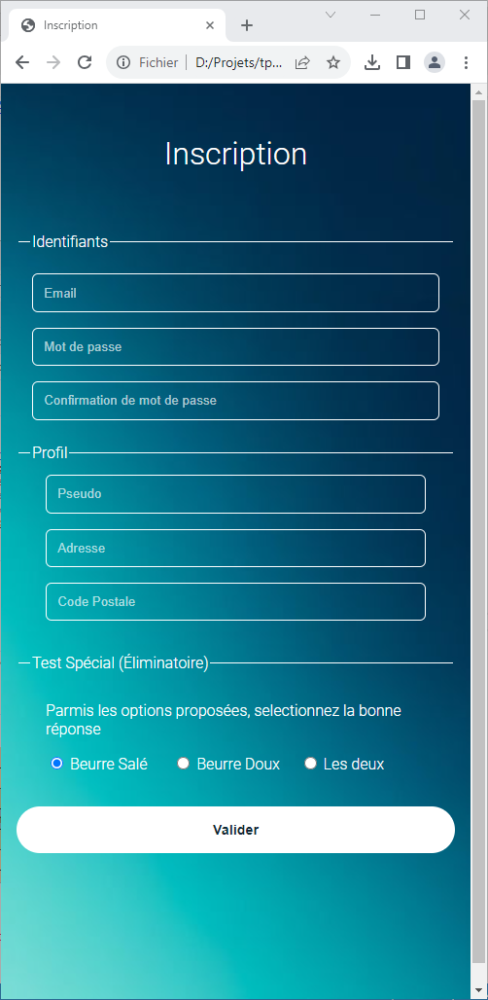
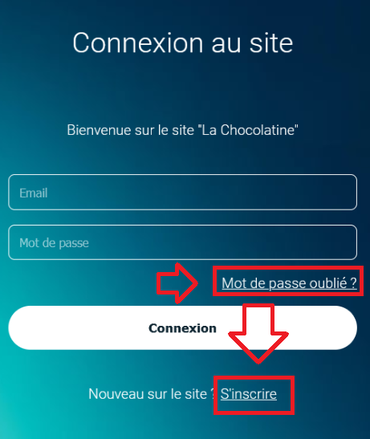

# Construire un écran d'inscription

TP du module 5 – HTML les liens

> **Note:** Avant de démarrer ce TP, il convient d’avoir suivi les vidéos des modules 1 à 5 et d’avoir réalisé les TP proposés.

**Durée Estimée : 1h**

## Enonce

Continuez le projet précédent pour ajouter une page d'inscription et faire le lien depuis la page de connexion.

L’objectif est de reproduire cet écran d'inscription en HTML/CSS

<p align="center">
  
</p>


Pour la redirection sur la page d'inscription, elle aura lieu grace à ce lien hypertexte :

<p align="center">
  
</p>

### Quelques astuces/informations 


#### Fieldset
Utiliser les fieldset et legend pour afficher un intitulé encadré


```html
<fieldset>
    <legend>Identifiants</legend>
</fieldset>
```

<p align="center">
  
</p>


Le code CSS du fieldset changera les bords et le texte en **blanc** et cachera tout les bords **excepté** le bord du haut

<p align="center">
  
</p>


#### Les options (radio buttons)

Utiliser les **flex** pour afficher les options sous forme de bloc alignés sur la **même ligne**

Dans chaque **div qui encapsule** les radio buttons, utiliser l'attribut `flex` pour que les éléments se partage la place entre eux (et ne pas utiliser des `width` à **100%** dans leur cas)
