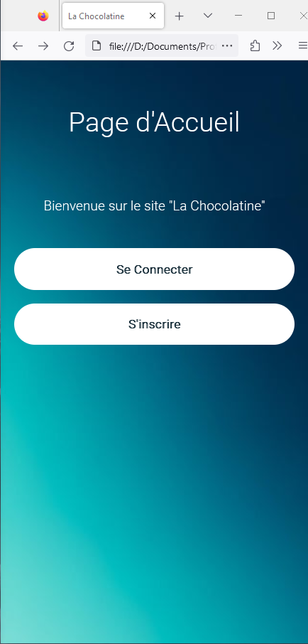
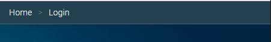
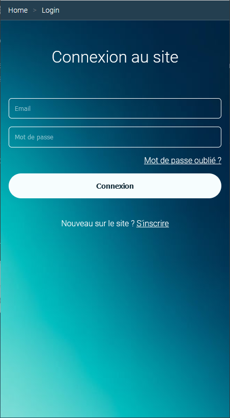
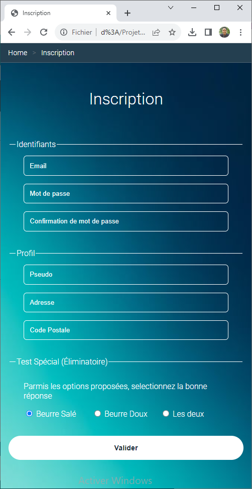
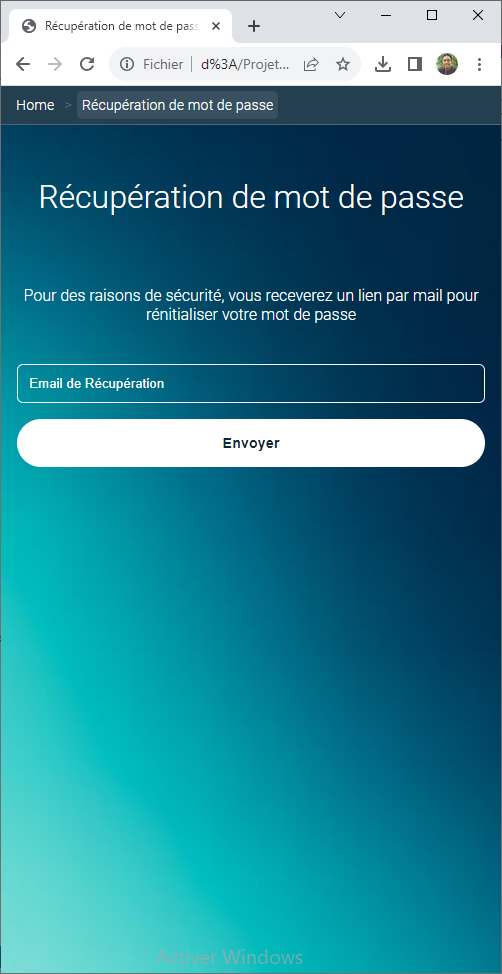

# Fil d'arianne

TP du module 6 – Les positions (Partie 1)

> **Note:** Avant de démarrer ce TP, il convient d’avoir suivi les vidéos des modules 1 à 6 et d’avoir réalisé les TP proposés.

**Durée Estimée : 1h**

## Enonce

Continuez le projet précédent pour ajouter une page d'accueil et un fil d'arianne sur les pages :

- Connexion
- Inscription
- Récupération de passe

La page d'accueil ressemblera à ca :

  

Quand au fil d'arianne, il sera positionné tout en haut sur les pages et ressemblera à cela :

  

### Page de connexion

Home > Login

  

### Page d'inscription

Home > Inscription

  

### Page récupération de mot de passe

Home > Récuperation de mot de passe

  

## Niveau de difficulté : 1

Faire au moins les pages :
-  **Récupération de mot de passe**
-  **Inscription**

> ⚠️ **Important:** Pour les 3 radios button (options), utilisez les flex.
> 
> Donc chaque option seront encapsulées d'un div et lces dîtes div eux même encapsulés d'un autre div

Et finaliser les liens dans la page **Connexion** qui redirige sur les pages correspondantes

- Mot de pass oublié -> La page **Récupération de mot de passe**
- S'inscrire ? -> La page **Inscription**

## Niveau de difficulté : Final

Faire tout le reste (page d'accueil et fil d'arianne)