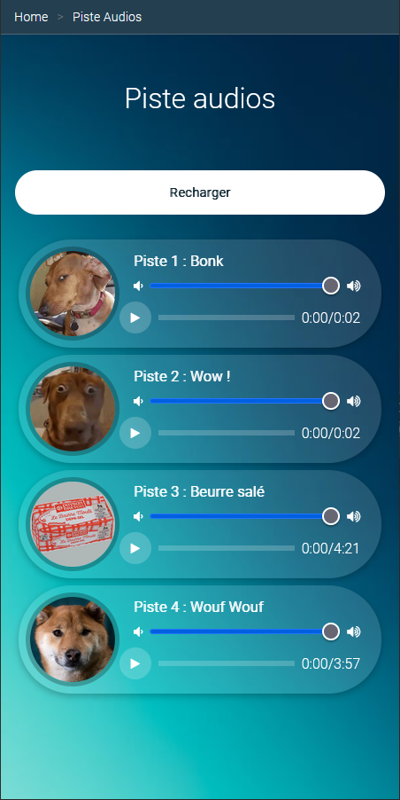
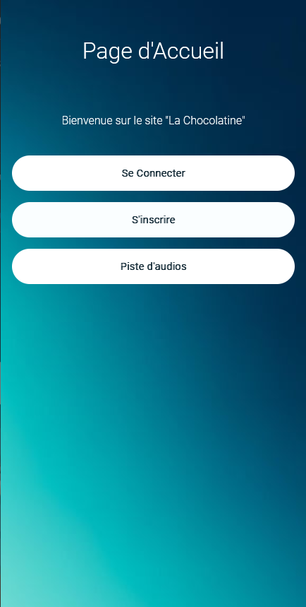

# Piste Audios

TP du module 09 – Design responsive plus complexe

**Durée Estimée : 1h**

## Enonce

Creer une page **Piste audios** pour ressembler à cette page:

  

Pour le moment il n'y pas encore de **son**, cette fonctionnaliée est reservé pour le TP Suivant.

Il est question ici d'uniquement de **Design**

Le bouton **Recharger** sert à rafraichir la page (donc un lien sur la page actuelle)

Nous ajouterons aussi un bouton pour accéder à cette page via l'**Accueil**

  

