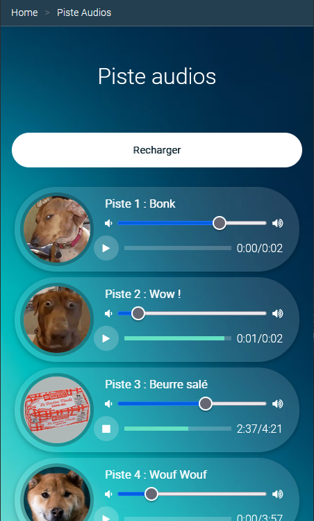

# Piste Audios - JS pour le son

TP du module 09 – JS

**Durée Estimée : 1h**

## Niveau de difficulté : ça commence à piquer

Les choses vont se compliquer avec le JS et la maîtrise des événements

## Enonce

La suite du TP précédent.

<p align="center">
  
</p>

### Jouer et contrôler la musique

La balise **audio** possède des événements qui vont vous être utile pour gérer le contrôle du son.

Un exemple d'utilisation :

```js
<audio>
    <source src="le_chemin_du_son_en_local" type="audio/mpeg">
    Votre navigateur ne prend pas en charge l'élément audio.
</audio>
```

> **Note:** L'attribute **controls** affiche un lecteur du navigateur, à ne pas utiliser puisque nous souhaitons garder le design actuel pour jouer le son

### Vision globale du procédé

Vous allez devoir itérer sur toutes les boîtes **div** ayant la même **classe** pour récupérer leur élément **audio** et les autres éléments qui nécessaires pour arriver à votre objectif.

Le bouton play de votre design va devoir lancer l'audio qui est dans la même boite **div** et vise versa pour la pause.

Pour changer le volume et afficher la timecode du son il va falloir jouer avec les événements des éléments html.