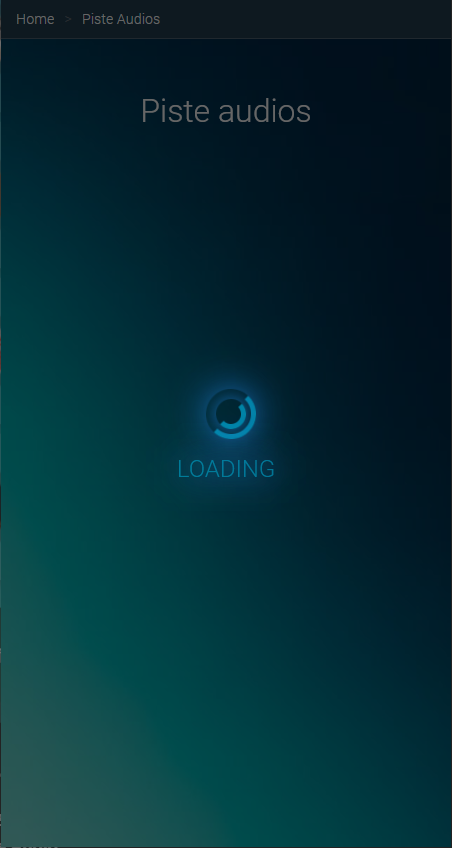
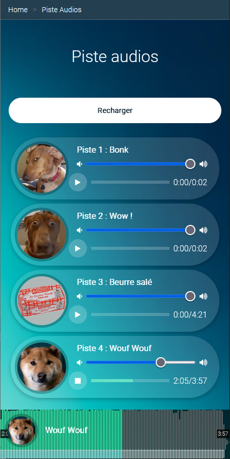
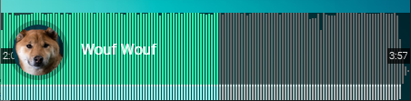

#  Piste Audios - Données dynamiques et chargement

TP du module Extra – JS + Inclure un Waveform

**Durée Estimée : 1-2h**

## Enonce

Faire le code JS nécessaire pour creer la liste des piste audios à partie d'un tableau d'objet **JS** et inclure un **Waveform**

Le résultat attendu:

<p align="center">
  
</p>

<p align="center">
  
</p>

### Extension VSCode pour serveur local

Installer le plugin **Live Server** sur VSCode pour démarrer un serveur local depuis votre page **Piste Audio**

Cela va etre nécessaire pour éviter les erreurs type **Cross Origin** afin de charger les ressources via le JS

### JS et Jeu de donnée

Exemple de tableau d'objet JS pour jeu de donnée

```js
let musics = [
    {
        id: 1,
        name: 'Bonk',
        profile: 'res/default_avatar.png',
        audio: 'res/votre_music.mp3'
    },
    {
        id: 2,
        name: 'Wow !',
        profile: 'res/avatar_1.png',
        audio: 'res/votre_music.mp3'
    },
    {
        id: 3,
        name: 'Beurre salé',
        profile: 'res/avatar_3.png',
        audio: 'res/votre_music.mp3'
    },
    {
        id: 4,
        name: 'Wouf Wouf',
        profile: 'res/avatar_2.png',
        audio: 'res/votre_music.mp3'
    },
];
```

Trouvez un moyen de charger un fichier html externe qui servira de template pour chaque item piste audio.

L'objectif est d'avoir un moment donné le code JS qui va itérer les pistes audio grâce au template html chargé de cette manière :

```js
function renderMusics(template) {
    let renderedHTML = "";

    let index = 0;
    musics.forEach(music => {
        let userHTML = template
            .replace('{index}', index)
            .replace('{id}', music.id)
            .replace('{profile}', music.profile)
            .replace('{name}', music.name)
            .replace('{audio}', music.audio);

        renderedHTML += userHTML;
        index++;
    });

    // Supposons que vous ayez une div avec l'id "tp-musics-container" pour contenir les musiques
    document.getElementById('tp-musics-container').innerHTML = renderedHTML;
}
```

### Wavesurfer

Vous allez utiliser la libraire JS **Wavesurfcer** accessible :via ce lien : https://wavesurfer.xyz/

Avous de vous documenter pour l"utiliser et essayer d'avoir ce rendu dans une div fixé en bas de la page

<p align="center">
  
</p>

L'objectif est de synchroniser le wavesurface avec la piste audio actuellement jouée.

Il faudra donc **muter** le **wavesurface** pour eviter d'entendre deux son joué en même temps.

Aussi lorsque vous jouez un son, vous allez devoir mettre à jour la photo et le nom qui survole le **Waveframe** en conséquence

ATTENTION : La **wavesurface** va devoir charger le **son actuel** en asynchrone. Donc il va falloir écouter l'événement qui va avec pour pour lancer l'audio au bon moment (et donc afficher la modal loading pendant ce chargement)

#### Les petits détails

Quand tout est terminé vous pourrez vous attardé aux petits details

Comme par exemple **afficher le wavesurfer uniquement lorsqu'on va joué un son**